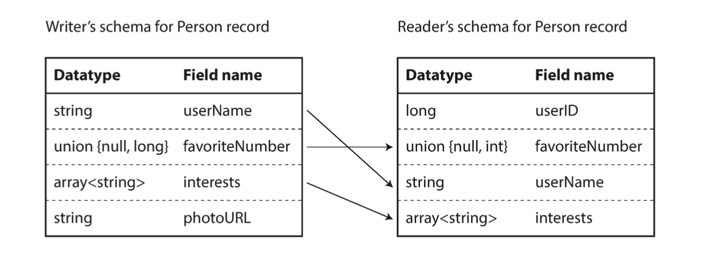
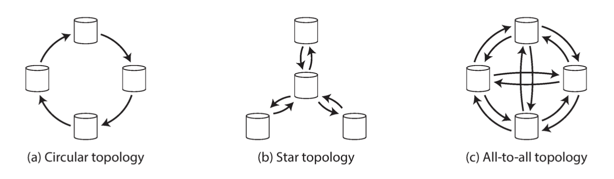
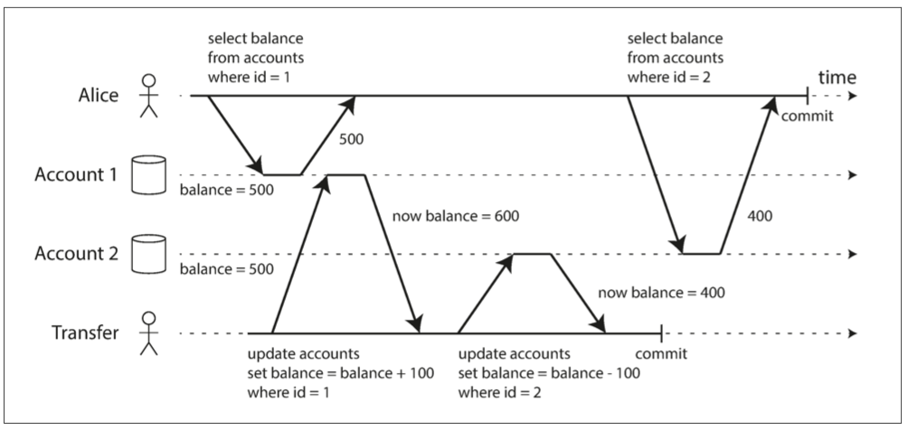
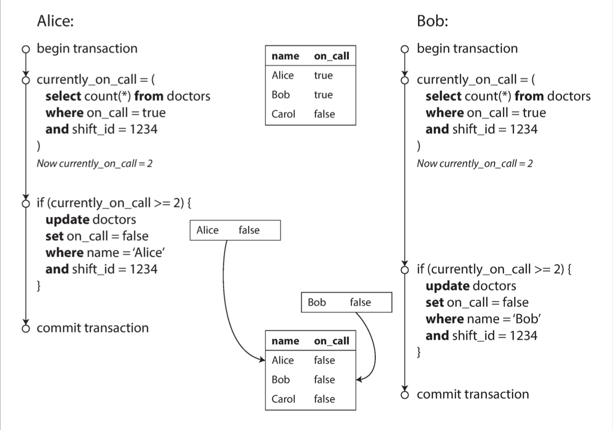
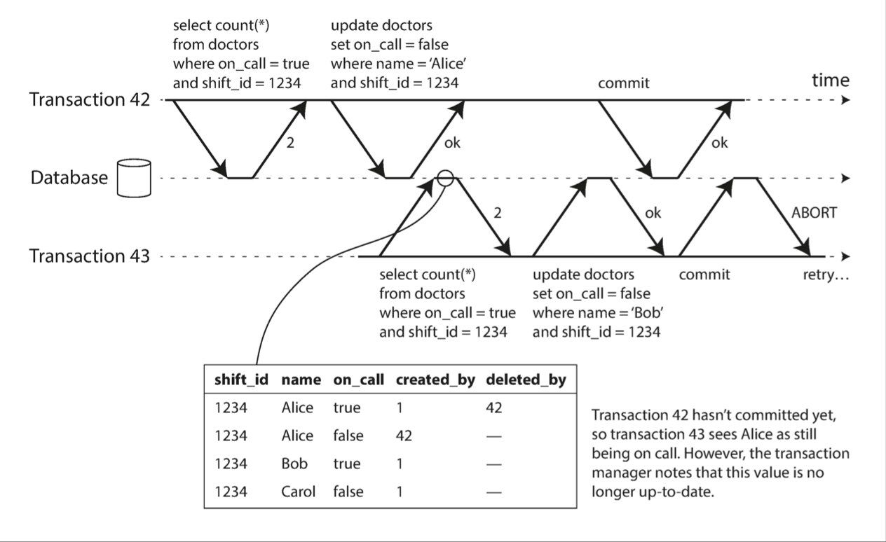
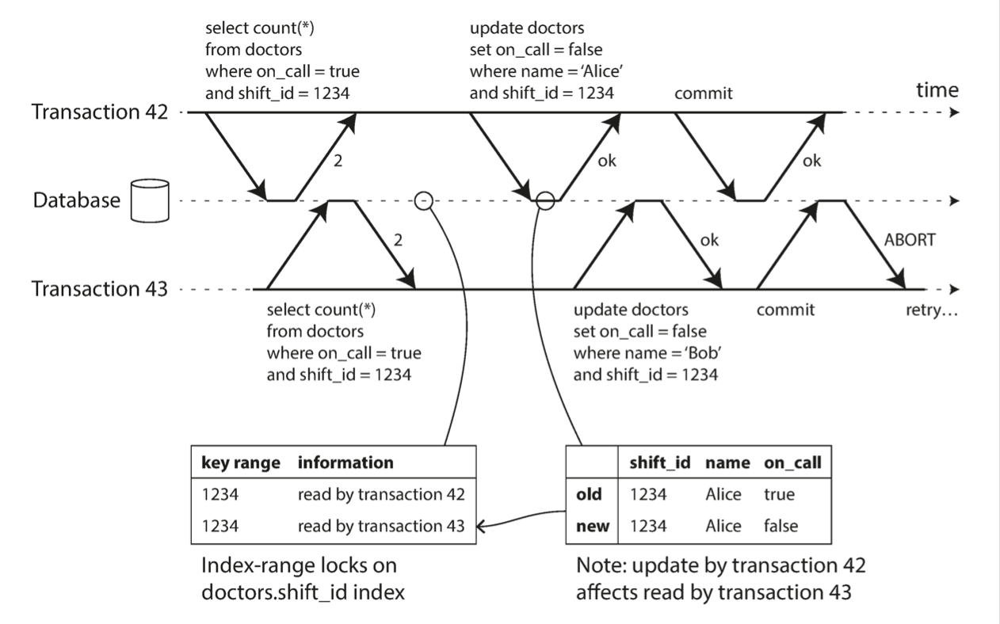

# Designing Data-Intensive Applications

# Part I - Foundations of Data Systems

# Chapter 1

---

# **Reliable, Scalable and Maintainable**

Nowadays, software systems tend to be more *data-intensive* than *computer-intensive*. In this era, three main characteristics are important in software systems:

- *Reliability*, the system should continue to work correctly even in case of *faults*.
- *Scalability*, an increase of load should not compromise performances.
- *Maintainability*, the effort required to apply changes to the system should not increase with the number of changes applied.

## Reliability

We stated that the system should continue to behave correctly even in the event of faults, but what is a *fault*? It is an *unexpected behaviour of a system’s component*.

Note that a **fault ≠ failure**, the latter is defined as a stop of the system from providing the required service to the user.

## Scalability

*We talk about performance*, but how do we measure it?

Typically, this is measured as *response time*, which is the time between a client sending a request and receiving the response.

<aside>
💡

Sometimes they are treated as synonyms, but *response time* and *latency* represent two different concepts: 

- The response time is the duration the client sees.
- The latency is the duration that a request is waiting to be handled.
</aside>

It is common to use statistical metrics for the response time. This is because response time is not constant: the same request can go through different system (and network) conditions.

A common measurement unit is *percentiles:* 

- A response time percentile P is the **maximum** response time that **P%** of the requests have.

How do we cope with load? The two main options are:

- Horizontal scaling, increasing the number of machines the system have.
- Vertical scaling, increasing the resources on the machines the system have.

Some systems are elastic, as they can automatically adjust the computing resources to match the load. This is useful when the load is highly unpredictable, but it may compromise the maintenance cost: it becomes harder to understand the system’s behaviour.

## Maintainability

For maintainability, we mean all those activities that involve keeping a system alive and able to evolve: fixing bugs, expanding features, monitoring, etc (KTLO).

When a system “is old” it means that many people have passed through it. 

Typically, the initial maintenance cost is cheap, but this increases if some principles are not respected:

- Operability, the operations team should easily work to keep the system running.
- Simplicity, it should be easy to understand the system removing as much complexity as possible.
    - The best tool for removing complexity is abstraction.
- Evolvability, it should be easy to make changes to the system in future.

# Chapter 2

---

# Data Models and Query Languages

The most important thing to consider when designing applications is how the data is represented. In a system, different data models are used at different layers:

- At the application layer, as a developer, you represent the real world with human readable objects and data structures.
- When these data structures needs to be stored, they are translated into JSON, XML, a table in a relational database, or a graph.
- Engineers who build the database needs to use a data model to store data to a disk, hence bytes.
- Again, engineers who build the hardware need to think about data in terms of electrical currents.

All these layers of abstractions simplify the job of developers: we just need to think about the application data model and how this is stored in the database.

From one level to another, there is a data translation layer. From the application level to the database level, typically this layer is called ORM (Object Relation Mapper). The translation between two data models may not be 1:1, some piece of information may be lost during the process. This phenomenon is known as *impedance mismatch*.

## Relational databases

This chapter mostly focuses on storage data models.

The most popular model used in databases is the relational one. In the past, several different models were born, called as *NoSQL*. They all try to explore:

- A need for greater scalability.
- A need for more specialised queries (text search, geometrical search…).
- A need for more schema flexibility.

However, it is still the most used one:

- The declarative query language allows the user to abstract from the search engine.
    - The search engine can choose the best algorithm for retrieving the “declared” data.
- Great support for joins, Many-To-One/Many-To-Many are well supported from relational databases.

## Document databases

As an alternative to relational databases, *document databases* have emerged. 

A document model represents the data as a unique document, commonly in a JSON format. Each field of data is represented in the same file, and a tree structure is used to model nested fields. This improves data locality. In a relational model, fields with a lot of information tend to be represented in separate tables, and foreign keys are leveraged to join data.

Generally, no schema is forced for documents.

- The data model is more flexible on write. However, the client reading the document should make assumptions on the data scheme.
    - A common term to this concept is about *schema-on-read*. For relational databases we talk about *schema-on-write*.

Data locality reduces the query complexity, however:

- The bigger the document, the higher is your network throughput.
    - You may fetch a full document only for reading a single field. It is suggested to **keep documents coincise and small**.
    - An update of a single field implies a write of the whole document on the disk.
- Not a great support for Many-To-One and Many-To-Many relations
    - In Many-To-One relations you are tempted to copy the same field value in each document. What happens when you need to change that value? Or you want that value to be consistent through all the documents? You need to change all the documents containing that field, you loose *normalisation*.
    - In Many-To-Many is even more complicated since you should copy the same data on both sides of the relation, this will convolute the document structure loosing the maintainability of it.
    - Many-To-One relations can likely become Many-To-Many, if we have used references from the beginning we would have done the migration in an easier way.
- The access of fields inside a document is not “ruled” by patterns. This implies that the client should know where the interested data is located inside the document.

Document databases have attempted to address these issues by introducing references and join queries; however, this is not the primary purpose of a document database, resulting in weak support for these features.

## Graph-Like Data Models

When the relationships between your data become more complex, with an increasing number of Many-To-Many relations, it is normal to start thinking of data as a graph.

There are two main data models for graph databases:

- *property graph model*
- *triple store*

In these models:

- There is no schema
    - A vertex can be connected to any other vertex.
- You can efficiently traverse the neighbours of a vertex.
- You can use different labels for different kind of relationships, without compromising clarity.
- It is easy to evolve
    - You can easily add relationships or new vertexes.

### Property Graphs

A graph consisting of vertices with:

- A unique ID
- A set of outgoing edges
- A set of incoming edges
- A list of properties (key-value pairs)

And edges with:

- The starting vertex
- The arriving vertex
- A label to specify the relationship between vertices
- A list of properties (key-value pairs)

### Triple-Stores

In a triple store graph, the information is stored in a triple composed of:

- Subject, equivalent to the vertex
- Object, which can be
    - A value in a primitive datatype
    - Another vertex in the graph
- Predicate, which can be:
    - A key if the object is a value
    - An edge if the object is a vertex

## Key Takeaways

- If your application has mostly One-To-One or One-To-Many localised relations, and you are sure that these will not became Many-To-Many, then the document database is the best fit for it.
- If you need your One-To-Many relations to be normalised and the data structure is not easy, you may want to evaluate using a relational database.
- Relational databases explicitly enforce a *schema-on-write*. Document and graph schemas are implicit, the reader is in charge for it.

# Chapter 3

---

# Storage and Retrieval

In this chapter, we discuss algorithms and data structures that a storage engine uses. In relational databases, there are two main families of engines used: 

- *log-structured*
- *page-oriented*

### Index

To efficiently find values for a particular key, the search engine leverages a different data structure derived from the primary one: an *index*.

The introduction of an index speeds up the read of data, but slows down the write:

- More data structures to update when the data change.

## Log Structured Search Engine

A log-structured search engine 

- Saves the data by only appending logs to a file:
    - Write (key, value)
- Retrieves the data by reading through the last inserted keys.

This is the simplest model, but let’s further explore it.

- If we only append values, we can throw away obsolete keys whose values have been overwritten.
    
    Say that we have the following file:
    
    ```jsx
    42 -> "value"
    11 -> 87
    42 -> "new_value"
    ```
    
    We can remove the first line of this file since the key `42` has a new value. This process is called *compaction*.
    
- If we keep appending elements to the same file, we will easily end up in occupying the whole RAM.
    
    Another optimisation is to split the data file into different *segments*. Once a file has reached a certain size, this will be saved on the disk. In the background a process will compact and merge these segments.
    

## Hash Indexes

The simplest index we can build: for each key, we store a hash map where the value is the file offset where the actual data is stored. It is trivial, but it also has some limits: 

- The Hash map must fit in the RAM. This may be a problem for big segments.
- Range queries are not supported: There is no order in the keys stored, so a ranged query is highly inefficient in this case.

## SSTables and LSM-Trees

If we slightly change the format of our segment files, we can have some advantage. In the *Sorted String Table* format, each segment has the data sorted by key.

- The merging process of segments is more efficient since we can leverage the *merge-sort* algorithm.
- The hash index table is sparse: we can just save a key each X logs. Thanks to sorted keys we can easily look up a key by scanning into a range of keys.

You still need to fit your hash index in memory, but it is lighter because it is now sparse.

This is cool, but how do you maintain the sorting while writing?

Around SSTables, a more sophisticated architecture has been designed: *Log-Structured Merge-Tree*. Consisting of keeping a cascade of SSTables while merging them in the background.

- On write, add the (key, value) tuple to a balanced in-memory tree. This is sometimes called *memtable*.
- When the memtable reach a certain size, the new SSTable can be efficiently written since the tree already preserves the sorted property. This will became the new segment written to the disk. While the new segment is being built, new writes can continue to a new memtable.
- Reads firstly hit the memtable, then the last created segment, then the next one and so on…
- In background merging and compaction of segments cleans up the data.

## B-Trees

Differently from log-structured ones, the B-Tree is a page-oriented data structure that does not leverage RAM, but keeps everything on the disk.

B-Trees break down the database into fixed-size blocks: *pages*.

- A page contains sorted keys and references to child pages.
- The leaf pages contain values instead of references.
- Keys between a reference indicate the boundaries of the referenced page.

| key 250 | reference of page containing 250-300 keys | key 300 | reference of page containing 300-350 keys | key 350 |
| --- | --- | --- | --- | --- |

The number of references on a page is called the *branching factor*. 

- A high branching factor lead the index to have all the data in few pages to scan.
- A low branching factor will end up in having several look ups to pages.

Updating a value will require searching for the key, then changing the value in the page and writing back the page to the disk.

Adding a new key will require finding the page where the new key will live, according to the ranges. If there isn’t enough space on the page, then the algorithm splits the page in two, creating two new pages. 

This process requires dealing with resiliency: what happens if the DB crashes while updating a page? We don’t want a corrupted index. This is why an additional data structure needs to be maintained in B-trees: *WAL(write-ahead log)*. Each modification to the B-tree is appended to the WAL file, such that if a crash happen we can restore the last index condition.

How do we deal with concurrency?

Log-structured indexes are easier on this point of view because they do not modify segments in place, but they always add them. B-trees instead need to deal with concurrency: while updating a page, they should use a lock mechanism to avoid race conditions.

### Optimisations

- To optimise on the concurrency level, some databases do not modify the page in place but use a copy-on-write. The page is copied with the additional informations and only the reference in the parent page needs to be changed.
- To save index space, we can also avoid storing the whole key in the pages since we just need the minimum amount of information to use them as boundaries of key ranges.
- In the time, additional pointers have been added to pages to make the scan algorithms easier. For example each page may contain also the pointers to the sibling pages.

## Advantages of LSM-trees

- They have a higher write throughput (amount of writes over time)
    - There is less *write amplification*
        - B-trees needs to write to minimum two structures: WAL and pages.
    - They sequentially write SSTables to the disk rather than overriding existing pages (random writes).
- Their structures can be compressed better, using less db storage than B-trees.

## Downsides of LSM-trees

- The background process compressing and merging segments can be resource-expensive.
    - So it may easily happen that, while this process is running in background, the disk blocks user requests for a lack of disk resources.
- The background process is not predictable at run time
    - This lead to a high variance of the response time. B-trees are more stable from this point of view.
- If the background process does not run enough times it may not be behind the new writes
    - Causing a loss of disk space
    - Worsening queries’ performances.

### How do we store the values in the index?

Do we store the whole value? Do we store a reference?

There are different approaches.

- If our db has multiple indexes on the same table, can be annoying to update the value of each index on a row update if this is stored in the index.
    - We can save references to a *heap file,* which is the place where rows are stored. When a row must be updated, we can just look up to this file and perform one single update.
- In some other situations, adding a layer of pointers in the indexes can lead to performance penalties we do not want to have.
    - We store the whole row in the index data structure, this is called *clustered index.*
- A compromise between storing a reference and the clear value can be a *covering index (or index with included columns)*
    - Just some columns are stored in the index, the rest goes to the heap file.

## OLAP and OLTP

During the time different access patterns have emerged.

- When the user typically queries a small amount of data, requiring low latency we typically talk about *OLTP (online transaction processing)*
- When a user requires aggregations of high amount of data, without the need of low-latency writes we talk about OLAP(online analytic processing)

These two access patterns are used to drive the choice of databases. In fact, a database optimised for OLTP use a completely different search engine than one optimised for OLAP. The term used for an OLAP database is *data warehouse*.

# Key Takeaways

- B-trees are faster for reads, instead LSM-trees are faster for writes.

# Chapter 4

---

# Encoding and Evolution

Applications are likely to evolve. A data schema that today is working, tomorrow may require a change.

- Add a new piece of information.
- Replace a piece of information.
- Deprecate a piece of information.

In modern applications, new and old versions of code may coexist. Hence, we need to pay attention to compatibility; We talk about

- *backward compatibility*
    
    When the new version of the code can read the old data format.
    
- *forward compatibility*
    
    When the old version of the code can read the new data format.
    

Applications usually cope with two different data representations.

- **Data structures** optimised for in memory manipulation. Such as objects, trees, lists, structs, arrays etc.
- **Bytes** that need to go through a network.

When the application needs to send data through the network, it *encodes* the in-memory representation into a sequence of bytes.

When the application needs to receive data from the network, it *decodes* the sequence of bytes into an in-memory representation.

In the time, many encoding formats have been designed.

## Language-Specific Formats

Programming languages have their own libraries for encoding and decoding in-memory objects into a series of bytes. An example is the Serializable Java library.

- These are not designed for compatibility with different programming languages. Two applications can not communicate each other if they are written in two different programming languages.
- Backward and forward compatibility issues are usually neglected.
- They are prone to cybersecurity attacks.
- Performances are not the best feature of these libraries.

Standardised encoding formats were built to be agnostic to programming languages.

## Textual Formats

Why don’t we translate our in memory representation into an easy to read string? like

```json
{
		"userName": "Martin",
		"favoriteNumber": 1337,
		"interests": ["daydreaming", "hacking"]
}
```

The most common text format used is the *JSON*, but also *XML*, and *CSV* are used. Their readability is the strong feature of this formats, developers can easily understand what the encoded data is representing. However

- There is some *impedance mismatch*
    - XML and CSV do not distinguish between numbers and strings.
    - JSON has problems to specify floating point numbers with a certain precision.
- JSON and XML have good support for character strings, but binary strings are weakly supported. Binary string s are used to contain voice, images and other media data.

The whole text string is encoded, this causes a relatively high size of the data sent through the network. If our bottleneck is the network throughput we can do much better!

## Binary Formats

Binary formats leverage the usage of a *schema*. The most popular binary formats are the **Apache Thrift** and **Protocol Buffers**.

```protobuf
message Person {
		required string user_name       = 1;
		optional int64 favorite_number = 2;
		repeated string interests       = 3;
}
```

Each format has a code generation tool that, taken the schema, produce the code to encode and decode messages.

The utilisation of the schema, allows to omit field names into the messages, they are just replaced by a numerical *tag*. 

In this case, encoding and decoding algorithms are more complex. Allowing to compact as much as possible the message size.

- One optimisation that Thrift does is to use variable-length integers. These allows the system to fit integers into less than the declared 8 bytes (int64) allocated for a number.
- Message format validation can be performed automatically.
    - i.e. if a field is `required` , a runtime check if the field is present.

The same message can see a significant reduction of size from JSON to Protocol Buffers: from 81 bytes to 33 bytes. Less than half!

### Schema Evolution

If we want to change the schema, we need to take care of some compatibility questions.

- *A tag is forever.* You can change the name of the field in the scheme, but tags is what the system globally uses to infer field position and values. You must never change it!
- *A new field must always be optional*. New code can easily skip optional fields that are not present.
- *Optional fields can be removed*. Never a required one!
- *Tags are not recyclable*! Data will be compromised if new code reads an old version of the data with recycled tags.
- *A data type **may** be changed* (you need to check the documentation). However, there might be some precision loss.
- *In Protobuf is possible to change an optional into a repeated field*. New version of the code see a list with one or zero elements. Old version of the code see just the last element of the list: this because the tag is repeated in the new version, and the code just override the read value into the field’s struct.

### Avro Schemas

A more optimised format of binary encoding is the Avro one. This leverages even more the schema: in the binary message, datatypes and field identifiers are omitted.

The key idea here is that the schema is different whether the code needs to encode (writer-schema) or decode (read-schema) messages. And these does not have to be the same, they just have to be **compatible**. The Avro library is able to check the schema compatibility.



The schema is exchanged between the encoder and the decoder with different patterns

- Per batch of messages.
- Can be versioned, each record have a version number useful for the Avro library to see which schema to use.
- Can be exchanged each connection setup.

### If I need to dynamically generate a schema?

The power of Avro against ProtoBuf and Thrifts is that it does not have to deal with tag numbers. This is important because simplifies the logic for dynamically generating a schema. If you have a database schema from where you would like to communicate, is straightforward to use Avro because columns can be easily mapped with record fields. In the other binary formats you have to maintain tags, a tag can not be repeated, must be unique and the logic for handling these case is more complex and less straightforward.

### Schema Evolution

- By default, fields are not nullable.
    - This forces the user to be explicit on what can and can not be nullable, reducing the risk of bugs.
        - Avro does not have optional and required markers as ProtoBuf and Thrift
- Fields can only be added or removed if they have a default value. Say we add a new field:
    - If the decoder reads with the new schema a message written with an old schema, it can assign to the new field a default value.
    - If the encoder writes with the new schema a message read by an old schema, it can assign to the new field the default value.

## Key Takeaways

- Textual formats are good enough for many purposes, especially as data interchange formats between two organisations.
- Binary formats are much more compact. However they needs to be decoded before they can be interpreted from an human.
- The presence of a scheme gives different advantages
    - A valuable reference for documentation.
    - Allows to check for forward and backward compatibility.
    - In statically typed languages you can have type checking at compile time.
- Avro format is extremely useful if we need dynamic schema generation.

# Part II - Distributed Data

When dealing with distributed systems, we need to expand our thinking by considering that data can be stored in and retrieved from different machines. 

Why do we need to distribute data across different resources?

- Scalability
    - Load can be spread across multiple machines
- Fault tolerance
    - The more machines I add in parallel, the more the system is tolerant to single faults.
- Latency
    - The shorter the physical distance between the client and the server, the lower is the response time. For a user base worldwide spread this can be fundamental.

## Scaling

How can we scale up our system?

### *Vertical scaling*

We can increase the resources of the current machines, however:

- Limited fault tolerance
- The costs grow faster than linearly
- The amount of load that a single machine can handle grows slower than linearly.

### *Horizontal scaling*

We can increase the number of machines. There are two common approaches

- Shared-disk architecture
    - Only the application layer is duplicated.
- Shared-nothing architecture
    - Both data and application layers are duplicated.

The Shared-nothing architecture is the most complex to deal with. We are going to argument on this since the Shared-disk is a subset of it.

## Data Distribution

When dealing with distributed machines, there is an important topic to consider: how is the data distributed across them? To answer this question we need to introduce the concepts of

- Replication
    - Each machine (aka *node*) stores a **copy of** the whole data.
- Partitioning
    - Each node stores a **partition of** the whole data.

# Chapter 5

---

# Replication

Replicating the data is one approach we can adopt to distribute the data.

Each node containing a copy of the database is called *replica*.

How do we replicate data across multiple nodes?

There are different methods we can use. Most of them conceptually split the nodes into *leaders* and *followers*.

## *Leaders and Followers*

The first method is the *leader-based replication:*

1. One node is elected as leader. Clients send write requests to the leader.
2. Once the write is applied, the leader sends the update signal to the other nodes (followers).
3. Reads can happen on any up-to-date node, writes only on the leader.

How do followers sync with the leader?

**Synchronously**

Writes on the leader can not commit until all the followers are up-to-date.

- 👍 This guarantees **data consistency** across nodes
- 👎 It reduces the fault tolerance. If one node is down than writes can not happen.

Usually, the semi-synchronous approach is used to leverage the fault tolerance drop that a synchronous system has. 

- A subset of followers is synchronously updated.

**Asynchronously**

This is the most common configuration. The leader is not blocked waiting that data is written on the followers.

- 👍 The system can continue processing writes even if followers are not up-to-date.
- 👎 Reads are eventually consistent.
- 👎 If the leader fails just before sending the update log, then this is lost.

### How do we set up a new follower?

It may happen that we need to set up a new follower node.

- A follower has failed and we need to replace it
- A new follower is required to scale up the system

This process requires some attention, we may just “copy-paste” the data from a done to another. However, since this process requires time, in the meanwhile there might have been other updates to be synced. 

The common approach is:

- Take a consistent snapshot of the leader.
- Copy the snapshot to the new follower.
- The new follower requests all the data changes to the leader since the snapshot timestamp.
- When the follower have processed the data changes then it means that it has *caught up*.

### How do we set up a new leader?

Handling a leader failure is more complex, there is an automatic process called *failover*.

1. Determining the leader’s failure. A common approach is to periodically send ping requests to the server, if the client does not receive the ACK message then it assumes that the leader is down. From this moment on the failover starts. 
    1. The pinging period is the parameter we can tune to influence the false positives/high availability threshold.
2. Choosing a new leader. A common approach is choosing the follower having the most updated data.
3. Reconfiguring the system to recognise the new leader. Followers must listen to new leader’s messages to keep up.

Even if it seems trivial, in practice there are many things that can go wrong:

- What the system should do with the writes that have not been synced before the leader failed?
- It may happen the so called *split-brain*: two followers believe they are both leaders*.*

This is the reason why some DB administrators prefer to perform manual failovers.

### How is replication implemented?

There are different methods for keeping followers up to date.

1. Statement-based replication
    
    The leader sends the statement logs: any query performed is sent to the followers. 
    
    - 👎 Followers are treated as high level separate nodes, using SQL as an abstraction is not a preferred choice.
        - If a statement runs a function (ex NOW() or RAND()) depending on the state of the node, this may end up in a consistency loss.
        - If there are auto-incrementing columns, statements should be executed with the same order in each node.
        - More in general, the statement output depends on the node’s state.
2. Write-ahead log (WAL) shipping
    
    We get rid of abstraction here, and we use the exact logs that the leader is sending to it’s disk.
    
    - 👍 Replication is consistent. The exact same data will be written in each other follower’s disk.
    - 👎 We are coupling the nodes.
        - Each replica should run the same DB version: a breaking change in the log messages can cause disasters.
        - Usually, is impossible to update database versions without downtimes if WAL is used.
3. Logical (row-based) log replication
    
    A *logical log* format is used to abstract from the row disk logs. This format contains the necessary information to keep followers updated.
    
    - 👍 It is easier to maintain backward compatibility. The logical translation layer allows to abstract the nodes from their disk.
    - 👍 Enables the system to communicate with also external systems that wants to read database updates (ex. a dashboard, or analytics db).
4. Trigger-based replication
    
    We may want to replicate data at the application level. Developers will write the replication logic based on triggers.
    
    - 👍 Totally customisable. Replication might be necessary for a data subset.
    - 👎 Prone to bugs.
    - 👎 Developer effort is required.

## Problems with Replication and Solutions

If we configure followers to be asynchronously updated, we are accepting the fact that some reads will not return consistent results. A system like this is usually defined as *eventually consistent*. The *replication lag* defines how far the follower is with respect to the leaders data.

What if, for some data, is inconvenient to have eventual consistency? What if one requirement is to not return results with a lag higher than X? 

### Reading Your Own Writes

Imagine you are in the backlog refinement session, and you just created a ticket to be discussed. Then your colleague refresh the page, but this ticket seems disappeared 🪄. But then after some seconds (sometimes also minutes) here it is your ticket ready to be discussed!

This is a scenario where eventual consistency worsen your user experience. A common approach to overcome this problem is to forward certain reads directly to the leader. Different strategies can be adopted:

- If we know that the reader client is likely to have performed a write on the data, than we forward their requests to the leader. Ex. in a social network, the only client that can update the user profile is the one logged in as the user themself. The other users can access other users profile by just using the follower replicas.
- We can put in the metadata the last updated date. If a short period of time has passed between the read date and the last updated date, then forward the request to the leader.
- The client can remember the most recent write timestamp, then the system can ensure that the replica serving the reads is consistent until that timestamp.

### Monotonic Reads

Now imagine your colleague has refined your magic ticket, saves it and then refreshes the page. What would they think if the ticket is not anymore refined? You may have amended their changes because of your touchiness 😂. Or the system does not guarantee *Monotonic Reads* 🧠.

Monotonic reads guarantee clients to never read older data than the one previously read/written. One way to obtain monotonic reads is to forward all requests of a user to the same replica. However, we need to switch replica when this fails.

### Consistent prefix reads

Replication lag can even let someone think about they are dealing with spirits sometimes 👻. This Is what you may think of Amy in the following chat:

```json
Amy: About then seconds
Lorence: How far into the future can you see?
```

This scenario happens when Lorence’s write, even if submitted before Amy’s answer, has been replicated with an higher lag than Amy’s one. 

A possible solution is to apply consistent prefixes that gives us the data ordering ability. However, in distributed systems is hard to define a concept of global ordering.

## *Multi-Leader* Replication

The main downside of having one leader is the fault tolerance: If it fails, your system can not anymore process writes. A Multi-Leader configuration can mitigate this problem. Furthermore, this configuration can provide the system:

📈 Better fault tolerance

- Typically, leaders are located in separated data-centers.
    - More tolerance to datacenter outages
    - More tolerance to network congestions.

🏃‍♂️ Better performances

- More that one node can process writes
- Leverage geographical proximity to clients to serve requests faster.

<aside>
💡

Other interesting use cases when we use multi-leader replication are

- Collaborative editing
    - Multiple clients must synch the changes on a shared resource. Local nodes represent the leader replicas.
- Offline operations
    - A local node can temporary write changes offline that successively need to be synced with the remote server.
</aside>

However, *all that glitters is not gold*…

### Write Conflicts

The biggest problem with Multi-Leader replication are write conflicts.

What happens if, at the same time

- User 1 updates the title of this document to “Designing Data Intensive Application” and it is recorded to Leader 1
- User 2 updates the title of this document to “DDIA” and it is recorded to Leader 2

Which of the two changes win? We don’t know, the changes are submitted on two different leaders and we have a conflict; the system needs to deal with.

If we had a Single-Leader, one of the two write would either be blocked or paused waiting for the other. In a Multi-Leader architecture, conflicts are detected asynchronously: once the two leaders share their writes, the system can detect them. We can also make leaders to synchronously share their updates, but this means that each client should wait for all leaders to be up to date, killing the main advantages of the architecture (performance and fault tolerance). If you want to have synchronous multi leaders, the Single-Leader architecture is a Pareto superior choice.

### Can we avoid conflicts?

The simplest solution to avoid write conflicts is forcing writes on one single leader for the same record. In practice each datacenter will be responsible of a database’s subset. With this we are mitigating the problem, but not completely solving it: What happens if a datacenter goes temporary off? 💥 If we decide to guarantee writes even if a leader has a fault, we still have to deal with writes on different leaders.

### Can we converge to a consistent state?

One issue of conflict resolution is that ordering is hard in distributed systems. How do we know who firstly modified the title of the document? There is not an easy answer to this. At least, we can force leaders to *converge on a consistent state*. The user experience would be poor if leaders have two different titles saved. For this reason we talk about *convergent conflict resolution*: each replicas must have that same final state of the record.

There are different ways to converge writes:

- Giving each write a unique ID, and keeping the highest one. This can be done for example with timestamps, using the so called *last write wins* technique.
    - 👎 Prone to data loss (further explained here).
- Giving each replica an unique ID, during the conflict we only keep data of the replica with the highest ID.
    - 👎 Prone to data loss (further explained here).
- Merge values together in a consistent way (ex. concatenate values).
- Write some application code that triggers a [custom conflict resolution](https://app.notion.com/p/Designing-Data-Intensive-Applications-2a14ef92d0c68073a782cd5f197008d0?pvs=21) process.

### Custom conflict resolution

We can write code to automatically resolve conflicts or prompt the user to do it. Resolution can happen in two stages:

*On write*

As soon as the database detects a conflict, a background process is triggered to automatically resolve it.

*On Read*

The system asynchronously save the conflict information. Then when data is read, the application can either solve conflicts automatically, or ask the client to solve them.

### Multi-Leader Topologies

When we have more than 2 leaders, there are various ways we can connect them for sharing the informations. 

The three main configurations are:

- *Circular*
    - Each leader receives messages from a leader and forwards them to another one.
- *Star*
    - There is one central leader responsible for sharing messages and orchestrate communications with the connected nodes.
- *All-to-all*
    - Every leader is connected to each other.

In Circular and Star, leaders need to handle less connections, and messages have a single path. Thanks to this characteristic is easier to deal with message ordering. However, fault tolerance is reduced since one single node failure can stop messages to be delivered. If the central leader of a Star configuration fails, then we will have a system fault.

While the all-to-all topology guarantees a more reliable writing system, this is also difficult to manage when conflicts happen: a global ordering of messages is harder to achieve since each leader receives writes from each other leader and this needs a more complex algorithm for solving conflicts.



## Leaderless Replication

What if we get rid of the leader-follower concept and each replica can accept writes from clients? This architecture is called *leaderless*.

If we mostly care about fault tolerance, this can be a good choice

- If we have N nodes, even if N-1 fails our system is still able to handle writes.

There are two common implementations of this:

- The client forwards writes to several replicas.
- A coordinator node receive writes from the client and forwards them to the other replicas.
    - Different from a leader because is just a message forwarder.

However, we need to deal with consistency issues.

### How do we handle inconsistencies?

It may happen that a node is slower than the other processing messages. If clients read from this, they may get *stale* (outdated) data.

Associating a version to the written records is a common common solution for this type of issues. Two approaches can be followed:

*Read Repair*

- When a client reads the same record from several replicas, it checks the version. If there are stale values, it updates the lagged replicas.
- This approach works if the values are frequently read: if years pass before a data is updated, inconsistency will last for more than expected.

Anti-entropy Process

- There is a background process that periodically compares nodes’ data, and, if there are discrepancies it copies the missing data into the lagged node.
- Data will not be copied in real-time.
    - This process is usually complex.
- Differently from a leader-replication approach, no order is guaranteed on copies.

### Quorum Reads and Writes

This configuration is prone to inconsistency, and it may cause bad user experiences if we do not control it. 

For example, suppose we have N = {n1, n2, n3} replicas.

- n1 and n2 are temporary down
- The client performs a write of V
    - n3 ACKs the write
- n1 and n2 have been restarted, but n3 goes down
- The client performs a read of V
    - Neither n1 and n2 contains the last version of it. An old version of V is read.

Can we shape our system such that, at least 1 replica returns the up to date value on a read? Yes, but we need to introduce the concept of *quorum.*

Given *n* replicas in a system,

- What is the minimum number of replicas *w* that should *ack* a write to consider it successful? (write quorum)
- What is the minimum number of replicas *r* that a client should query to get an up to date value? (read quorum)

If they follow the equation below, then we have a guarantee that at least one of the r nodes is up to date.

$$
w + r > n
$$

- If this is satisfied, then $R \cap W \neq \emptyset$ →  $\exists r \in R : r \in W$

*w* and *r* directly affect system performance and fault tolerance:

- If a dataset is not frequently written, setting *w = n* and *r = 1* would speed up reads since clients need to wait only for one node. However, if one node fails, writes can not happen.

If we mostly care about low response time and high availability, we can also accept to read stale values setting *w* and *r* such that $w + r \leq n$

⚠️ The above described may seem a magic formula that can save us from inconsistent data. However, there are other problems that can happen:

- What happens with concurrency? If two operations happen concurrently, the system overall status is undetermined. We need to handle this situation, this topic will be covered [next](https://app.notion.com/p/Designing-Data-Intensive-Applications-2a14ef92d0c68073a782cd5f197008d0?pvs=21).
- What happens if a write succeeds on some replicas but fails on others, rolling back? We may end up in misaligned replica states.

Even if it we accept to have stale data, it is important to control it: having heavily lagged replicas may cause unexpected behaviours. Sometimes you are forced to define how much “eventual” your system should be consistent.

However, measuring the staleness of a replica is not an easy task

- In leaderless replication there is no write order concept. This characteristic makes hard to define a concept of how delay a certain replica has compared to another one.

### Sloppy Quorums

What if we would like to guarantee availability also if our quorum is not reached? A solution is to use *sloppy quorums*: if the quorum is not reached, we forward requests to temporary nodes outside of the N nodes of the system. Basically, if some internal nodes fail we are borrowing some of them from another system.

It is like if, one night you forget about your home keys and you ask your neighbour to sleep on his couch. 🛋️ 

Once the nodes composing the quorum are back on track, any write request handled by our neighbour node will be sent to our home node. This operation is called *hinted handoff*.

However, we need to pay even more attention to consistency here: in any point in time, even if you have $w + r > n$, is not guaranteed that your client is going to read the latest value.

### Handling Concurrency

Concurrent operations are the worst enemy for leaderless systems. 😈

What if, concurrently 

- Client A set X = A
- Client B set X = B
- Node 1 handles first Client 1 request
- Node 2 handles first Client 2 request

We will end up in a state where:

- Node 1: X = A
- Node 2: X = B

In this scenario, nodes would be permanently inconsistent. There are some techniques we can use to overcome this issue.

**Last write wins (LWW)**

One approach is to only **store the most recent write**. Even thought, in concurrent operations, the order is undefined, we can always give an arbitrary order to requests. For example, using the write timestamp of the client sending the request. 

This approach is simple to implement, but has the cost of durability: during a conflict the oldest value can be discarded. Or, even worse, if the system mistakenly identified the writes as concurrent we may risk drop meaningful writes. The advice is to use this approach when dealing with immutable keys, such that their values can not be updated concurrently.

**When operations are concurrent?**

To correctly solve race conditions, we firstly need a way to detect whether two operations are concurrent. If we have two operations A and B, and we are able to say that some of them happened before the other, then these are not concurrent. If we treat them as concurrent then we may mistakenly overwrite values.

We say that two operations are concurrent when neither happened before the other and their order is undefined. In this situation we need an algorithm that can capture the *happens-before* relationship. 

Here is how it works:

Each key is associated with a version. A key usually contains

- A value
- A version
- A some of sibling of the value (further explained next).
1. The client reads the key.
2. The client writes the key passing the version of the last read key. If the key contained siblings, it is client responsibility to merge them into one single value to be overwritten.
3. The server receive the write request and gets if
    1. It *happened-after*: If the version of the write request is above the version currently in the server, then overrides the value and increments the version.
    2. It *happened-concurrently*: If the version of the write request is below or equal to the version currently in the server, then write the value as a sibling.

In this algorithm the version number, allow to define the happens-before relationship. The server knows from which previous state the request has been built on and can define if there has been a concurrent event. If the version number is not provided, then the server assume that the request is concurrent and it is added to the siblings.

The steps were assuming a 1 client and 1 server scenario, but what happens when we have multiple servers? The logic remains the same, what will change is the version structure: The version became a vector of N dimension, where N is the number of replicas of the system. Each replica increments it’s own version number.

**How is merging performed?**

A common approach is to use the union operation: $(1,3) \cup (2,3) = (1,2,3)$

However, if a client explicitly deleted the value $1$, then it will remain in the result until all the concurrent operations have removed it as well. To overcome this problem we usually assign tombstone flags to elements that need to be deleted.

# Chapter 6

---

# Partitioning

With replication we improve the fault tolerance of our system, however if the system needs to handle an high throughput of requests on large datasets we need to act on the scalability. Here is when splitting up data into *partitions* can help (also known as *sharding*).

With partitions, your data and your queries are distributed across many disks and processors. There are different concepts of partitioning that are interesting to explore:

- How partitions are created?
- How indexes are handled?
- How are partitions rebalanced?
- How requests are routed over the partitions?

## Distribute Data Into Partitions

The first interesting aspect is to define the distribution logic of the data into partitions. 

We need to scale, so we need our data to be:

- Equally distributed over all the partitions.
- Easy to query.

If data is unfairly partitioned, it is called *skewed*. This creates partitions with a not proportionate high load, also called *hot spots*.

The easiest strategy to distribute data is to assign each record a random partition. However, we will struggle to know where that data is stored when we need to query it. We can do better.

### Partitioning By Primary Key

Assuming that you have a key-value data store and you access the data by primary key. We can distribute the data by keys, such that each partition owns a set of contiguous keys.

- 👍 It is easy to implement and given a key you can easily get in which partition the value is stored.
- 👍 If keys are sorted, range scans operations are efficient.
- 👎 Data distribution within partitions is dependent on the keys distribution.
    - A given key range may contain an high number of entries with respect to another one, causing hot spots.

### Using a Hash

To overcome the issue of unequally distributed keys, a common solution is to use an hashing function to transform the set of primary keys in to a distributed set of hashes. The hashing function needs to be properly chosen to guarantee the distribution requirement.

- 👎 The key sorting order is lost, range queries are not efficient.
    - Cassandra DB achieves a compromise by defining a compound primary key: The key is composed of more than one fields, and only the first are hashed. The other fields are used for ordering data within the partition. Say you have the (user_id, timestamp) update logs, if you just hash the user_id, then you can easily query scanning through the timestamps.

A hash can help to reduce the risk of hot spots, but it would never completely remove them: There may always be some keys that are frequently read/written. Example the user profile of influencers in a social network DB.  

## Secondary Indexes

What if we remove the assumption of having a dataset always queried by the primary key? We need a way to handle secondary indexes in order to not lose query efficiency. The problem with secondary indexes is that they don’t map neatly to partitions. To solve this issue there are two approaches:

- Document-based partitioning
    - The index, also called as *local index*, is stored inside each partition. The index key is used to keep track of the primary keys associated to that attribute.
        - 👍 Easy writes: Each partition maintains it’s own index.
        - 👎 Hard reads: Queries by second indexes needs to scan through all partitions for gathering data. Operation also called as *scatter/gather*.
- Term-based partitioning
    - The index, also called *term-partitioned*, in this case is global, handled differently from the primary one. The index can be partitioned as well, but with a different logic from the primary key one.
        - 👍 Easy reads: A query just needs to access the right partition in which the secondary key is stored.
        - 👎 Hard writes: A write query needs to update the indexes in all the partitions.
        - 👎 Inconsistency risk: A distributed transaction over partitions is required to have the secondary index synchronously updated each write, something that is not supported in DBs. Hence, the index updates in term-based partitions is usually done asynchronously.

## Rebalancing Partitions

Over time, many things may change in a DB:

- You need to increase the CPU resources.
- You need to increase the memory on disk or RAM.
- A machine fails and you need to perform a failover.

These changes will call for *rebalancing* the nodes in the cluster.

Each rebalancing must meet the minimum requirements of:

- After rebalancing, the load should be spread fairly across the nodes.
- While rebalancing, the database should continue accepting requests.
- No more data than necessary should be moved.

To achieve rebalancing, there are different strategies we can adopt.

### Rebalancing Strategies

1. **hash mod N**
    
    The simplest approach we can think of is distributing the keys to partitions using the mod N operator. Where N is the number of partitions. We are ingenue thought. What happens when N changes? Luckily every key needs to be readdressed to a new partition. Causing an useless overload of data migration within partitions. We need to rebalance data but minimising the amount of data to be moved.
    
2. **Fixed number of partitions**
    
    Another simple approach that works better is setting a fixed number of partitions, and assign more than one partition to the same node. In this case we have the flexibility of moving around partitions rather than single records. Say we have *P* partitions and *N* nodes, then each node will have *P/N* partitions. If a new node appears, then each node gives a partition to the new one until they are again fairly distributed.
    
    Since this process is not immediate, the old configuration is guaranteed to serve requests while the transfer of data is in progress.
    
    The main difficulty here is how to choose the number of partitions *P*. 
    
    - A high number of partitions can cause excessive partitions’ management overhead.
    - A small number of partitions can impact the scalability of the system.
3. **Dynamic partitions**
    
    Some DB, like HBase and RethinkDB, create *partitions dynamically*. We can assign a maximum size of a partition (say 10 GB), and when the limit is reached, this is split. After the split, the halves can be distributed to other nodes to equally distribute the load. If a partition became too small, we can also decide to merge two partitions together and lighten the complexity on the partitions’ manager.
    
    Ideally we would start with a single partition on one single node. The bigger the data to store the higher the number of partitions we are going to have. A caveat with this approach is that we start by having all the data to a single node: we have a single point of failure. To mitigate this issue, many DB already apply a *pre-splitting,* creating a minimum amount of partitions spread over all the nodes.
    
4. **Partitioning proportionally to nodes**
    
    The last two approach set up a direct dependency between the partitions and the dataset size:
    
    - In the Fixed number of partitions → Size(partition) ~ Size(Dataset)
    - In the dynamical partitions → #P ~ Size(Dataset)
    
    Since the Dataset size is something we do not control, there is a third approach that couples the number of partitions with the number of nodes #P ~ #N. In this way we keep a fixed number of partitions per node. Generally, if the size of the partition increase then there is a signal to add a new node. By adding a new node, some of the big partitions can be split and give the halves to the new node. This process automatically redistributes the dataset, and big partitions became smaller again keeping their size stable.
    

## Request Routing

In a partitioned system, another aspect to consider is the routing of the requests. Which is the node able to serve the requested operation? This is a common *service discovery* problem.

There are three different approaches to this problem:

- The client sends the requests to any node, then this node is responsible to rerouting the request to the correct node.
- The client send the requests to a routing node, then this is responsible to rerouting the request to the correct node.
- The client send the requests to the correct node, since it is responsible to know which is the correct node.

This problem is present also in the context of DNS resolution. Most of the DBs use an external tool able to map requests to the correct nodes. The most famous tool is the ZooKeeper. Some other DBs as Cassandra and Riak use a *gossip protocol* where each node knows where the data is stored, enabling to use the first approach.

## Key Takeaways

- Partitioning is necessary when you have so much data that storing and processing on a single machine is no longer feasible.
- 3 main partitioning approaches
    - Key partitioning: Sorting advantage, Risk of hot spots.
    - Hash partitioning: Distribute load evenly, Sorting disadvantage.
    - Hybrid approach: use a compound key.

# Chapter 7

---

# Transactions

One of the most famous words in the field of Computer Science is *transaction*. We use to think about transactions as the tool that guarantees atomic operations. We almost give for granted, but actually they are simplifing the job of system designers preventing them to thimk about possible failures within operations. In fact, a transaction is a way to group different operations into a logical unit, such that they can either succeed or fail as a group. 

They were created to simplify the programmign model of applications accessing a database. However, we should not give them for granted expetially in the era of distributed systems.

In the 1983, Theo Härder and Andreas Reuter associated to transactions the most popular acronym: ACID. Standing for Atomicity, Consistency, Isolation and Durability. These concepts definitions are abit misleading because of at the time they didn’t have the whole context of the Computer Science word that has beed developed. We are going to analyse their definition declining them into modern systems.

***Atomicity***

If a fault occurs within different writes in the same transaction, then all the changes are discarded.

Nowadays, when we read the “atomicity” word we tend to think about concurrency, even if in this definition there is no reference to pmuti-threading. But, we can also see this property as the capability of the system to only show/not show the final result of a group of operations, without midifying any state until the transaction has committed.

***Consistency***

If you have certain statements about your data (invariants), then these should always be true.

Also in this definition, the word *consistency* is such overloaded that is almost confusionary to associate the right sense to this definition.

Here cames also the big critic of Kleppman: Only the low level invariants are handled by the database system (primary key, type constraint, uniqueness). Most of the invariants are defined at a higher level, where the application is responsible of (ex. user DOB can not be higher than 150y).

***Isolation***

Each transaction runs isolated from the other. The database always ensure that concurrent transactions appear as they have runt serially.

***Durability***

Once a transaction is committed, the data will not be *ever forgotten*.

This definition hides a strong assumption: each device we use to store the data will never fail. As we can imagine, nothing could prevent that all the hardware we use to store the data will fault.

---

# Chapter 7

---

# Transactions

One of the most famous words in the field of Computer Science is *transaction*. We use to think about transactions as the tool that guarantees atomic operations. In fact, a transaction is a way to group different operations into a logical unit, such that they can either succeed or fail as a group. They simplify the system designers’ work allowing them to avoid thinking about partial failures of operations inside the same transaction. They were created to simplify the programming model of applications accessing a database. However, we should not give them for granted especially in the era of distributed systems.

In the 1983, Theo Härder and Andreas Reuter associated to transactions the most popular acronym: ACID. Standing for *Atomicity, Consistency, Isolation and Durability*. Ay the time the Computer Science context was a bit different, hence their row definition can appear a bit misleading. We are going to decline their definition into modern systems.

***Atomicity***

If a fault occurs within different writes in the same transaction, then all the changes are discarded.

Nowadays, when we read the “atomicity” word we tend to think about concurrency, even if in this definition there is no reference to multi-threading. We can also see this property as the capability of the system to only show/not show the final result of a group of operations, without modifying any state until the transaction has committed.

***Consistency***

If you have certain statements about your data (invariants), then these should always be true.

Also in this definition, the word *consistency* is such overloaded that is almost misleading to associate the right sense to this definition.

Here comes also the big critic of Kleppman: Only the low level invariants are handled by the database system (primary key, type constraint, uniqueness). Most of the invariants are defined at a higher level, where the application is responsible of (ex. user DOB can not be higher than 150y).

***Isolation***

Each transaction runs isolated from the other. The database always ensure that concurrent transactions appear as they have runt serially.

***Durability***

Once a transaction is committed, the data will not be *ever forgotten*.

This definition hides a strong assumption: each device we use to store the data will never fail. As we can imagine, nothing could prevent that every hardware we use to store data fails 😜.

## Transaction Isolation

If two transactions running concurrently touch the same data, then the database may incur in concurrency issues. Most of the databases provide the *transaction isolation* property. However, it is not trivial and is interesting to see how it works. The common approach is to use *serializable isolation,* guaranteeing that transactions have the same effect as they run in sequence. But this has a performance cost. Since transaction isolation implementations can also have problems. Is therefore common for systems to use weaker levels of isolation. For this reason, we should develop a good understanding of the kinds of concurrency problems that exist. We are going to dive deep into several weak isolation levels, looking at the problems that can occur.

### Read Committed

The most basic one is the read committed transaction isolation level, which guarantees:

- No dirty reads: clients will only see data that is committed.
    - Only committed data will be visible to other transactions.
    - Useful to guarantee the isolation property of more than one operations in the same transaction
    - **Implementation:** For implementing this we can use a row-level lock, however this approach harms the response time. As an optimisation, most databases use to version rows. In this way, reads can always get the not yet committed version at the time of the request.
- No dirty writes: clients will only be able to update data that has been committed.
    - If two transactions are running in parallel trying to write the same data, generally one of the two should wait for the other to avoid a dirty write.
    - **Implementation:** Implemented with a row-level lock: if a transaction needs to write over that row, it must acquire the lock. Other transactions can not acquire the lock until the one that is using it has committed and released it.

### Snapshot Isolation and Repeatable Read

The read committed give you some isolation guarantees. However, If two resources are tightly coupled, you want to treat them as an unique one.

In the below example, Alice's money is split into two accounts. If Alice reads from account 1 before the import is updated and from account 2 just after it is updated, then she may start to panic for their missing 100$...



This anomaly is called *non-repeatable read* or *read skew*. It can lead to temporary inconsistencies, especially in the case of:

- Backups
    - A backup process can catch the system in the inconsistent state and keep that state for some time.
- Integrity checks
    - Is common to have integrity checks, in case of inconsistencies these may cause disruption.

#### Multi Version Concurrency Control (MVCC)

**Snapshot isolation** is the most common solution to this problem. It consists in keeping different versions of data, such that a read transaction can only get the data that has been updated before the current timestamp. The most used technique for implementing snapshot isolation is *multi version concurrency control* (MVCC):

- Each transaction, when started has an automatically increasing transaction ID.
- Each row contains two technical fields
    - created_by: containing the ID of the transaction that created the row
    - deleted_by: rows are never deleted, but always marked as deleted because can be useful for transactions with a lower ID.
- An update is internally translated into a delete and a create.

Rows are never updated in place, but a new object version is created and the old version is tagged as stale.

The process for getting consistent snapshots is the following:

1. At the start of a transaction, the database makes a list of transactions that are in progress. Every change applied to these transactions is ignored.
2. Any writes made by aborted transaction are ignored.
3. Any writes made by later transaction IDs are ignored.
4. All other writes are visible to the application's queries.

The garbage collector is then responsible to clean up all dead rows that are not anymore used.

### How are indexes managed?

There are two approaches:

1. The index point to all versions of an object then there is a filtering from the query engine.
    1. The garbage collector is responsible to remove all pointers in the index.
2. At each write transaction, a new version of the index is created. Each index root contains a consistent snapshot representation at the point in time when it was created.

## Preventing Lost Updates

There are several other conflicts that can occur in concurrent transactions. One of these is the *lost update* problem: It can occur when two transactions in parallel perform a read-modify-write cycle. One of the two transactions can modify the data based on an outdated version of it if the other transaction commits.

Example: incrementing a counter

1. i = 0
2. T1: reads i = 0
3. T2: reads i = 0
4. T1: modify i++ (i = 1)
5. T1: commits i = 1
6. T2: modify i++ (i = 1)
7. T2: commits i = 1
The counter at the end of the cycles has lost the update coming from T1.
There are various mitigations for this problem.

### Atomic write operations

Many database provides you with atomic operations that give concurrency safety. Like the following operation:

```
UPDATE counters SET value = value + 1 WHERE key = 'foo'
```

- 👎 Not all writes can be expressed as atomic operations

They are usually implemented by taking an exclusive lock on the object when it is read, so that no other object can read it until the operation has finished.

### Explicit locking

If atomic operation is not supported for our use case, we can explicitly lock objects through the application code.

In SQL the `FOR UPDATE` clause indicates that the database should take a lock on the rows returned by the query.

### Automatically detecting lost updates

Nowadays many database automatically detects lost updates when a transaction is about to commit, forcing it to retry if it happened. Databases can perform this check easily if they use MVCC.

### Compare and set

Another approach is to only allow the update to happen if the value has not changed. This is usually called a compare-and-set operation and it can be like this:

```
UPDATE wiki_pages SET content = 'new content'
	WHERE id = 1234 AND content = 'old content'
```

You should double-check that the database only reads from the newest snapshots.

### Lost updates on replication

If we have a replicated DB, then we need to do some additional step for preventing lost updates. compare-and-set does not work because they assume that there is one single node keeping the updated version of the data.

A common mitigation is to create several conflicting versions of a value and use application code to [solve the conflicts afterwords](https://app.notion.com/p/Designing-Data-Intensive-Applications-2a14ef92d0c68073a782cd5f197008d0?pvs=21). 

## Write Skew and Phantoms

Another conflict is the so called “write skew”. it is a race condition that happens when the condition to decide whether to write or not is based on an aggregation query. Consider the following example:

Alice and Bob are both doctors and they needs to do an on-call shift. Minimum 1 on-caller needs to be present. But Alice and Bob  wants to remove themself from the routa, and they do it concurrently. The read operation consists in counting the number of operators in the shift where the on_call field is true. Can happen that:

1. Bob reads the amount of on-callers (currently_on_call = 2)
2. Alice reads the amount of on-callers(currently_on_call = 2)
3. Alice checks if currently_on_call ≥ 2
    1. If yes removes himself from the routa
4. Bob checks if currently_on call ≥ 2
    1. if yes removes himself from the routa
5. Alice commits
6. Bob commits
7. We have no one on-call 😱



This is happening because the two transactions do not read from the same entity, but extract informations on a table. This is a more general case of lost updates conflicts.

Possible solutions are:

- Use serializable isolation level in the DB
- Lock all the rows involved in the operation.

More in general, the pattern of these kind of race conditions is:

- A SELECT query checks whether some requirements is satisfied.
- Depending on the result of the first one, the application decides how to continue.
- If the application decides to continue, then it makes the write.

So, the effect of when a write query changes the result of a search query in another transaction is called a *phantom.*

### Materialized conflicts

For some cases, locking rows is more tricky because a check could be on the absence of rows (ex. I want maximum 1 host in the patient visiting room).  And we can not attach any lock to the raw. To overcome this problem, we can create some materialized conflicts: we structure the table such as that absent row is already in the db, but inactive. In this case the SELECT can perform assertions on the empty row.

## Serializability

All of these conflicts can be solved by implementing Serializable isolation level into the DB.  This provides you with the strongest isolation level. However, performances are impacted. There are three ways of implementing serializability:

- Executing transactions in serial order.
- Two-phase locking.
- Optimistic concurrency control techniques.

### Actual Serial Execution

The simplest way of avoiding concurrency problems is to execute only one transaction at a time, in serial order, on a single thread. Given the fact that nowadays hardware is more porweful, it has became affordable to have a single thread handling in series operations, with good performances. In order to make the most  of the single thread, transactions need to be structured differently from their traditional shape.

It has also been observed that, single-threaded systems sometimes perform better than systems supporting concurrency, because they can avoid the locking overhead.

Single threaded databases use to prefer the usage of stored procedures: these are script where the client asynchronously submit to the DB operations to perform. This is needed to avoid situations where the client holds a transaction for long time: since there is a single thread, a transaction waiting for the client response is sensible on the performances.

- Since each DB vendor use to have its own language for a stored procedure code it is a bit difficult to deal with sometimes.
    - However, some DBs in the time have adopted general purpose programming languages (i.e. Java or Groovy in VoltDB, Lua in Redis)
- The code is running on the DB machine and not on the application one. this makes the procedures difficult to debug.
- A single-threaded DB is generally more sensible to performances than an application server.

When you have a high throughput requests, a single threaded system can be a bottleneck. a solution can be to use partitions. You can give each partition a CPU. However, we are adding a partitions coordination overhead.

### Two-Phase Locking (2PL)

This has been the most common approach used for 30 years. The core idea is to introduce a lock on the object level on read and write. Differently from snapshot isolation, no matters if transaction is reading or writing the object, it needs to hold the lock. This approach prevents from all the racing conditions discussed earlier.

The lock can be shared or exclusive, if a transaction needs to read the object can hold the shared lock. With a shared lock, other transactions can read the object. If a transaction needs to write the object, then it needs an exclusive lock and other transactions can not access to it.

Deadlocks are common in this  configuration. Usually the db automatically detects them and abort one of the two transactions involved.

The main downside of this solution is it’s performance. Transaction throughput and response time are significantly worse compared to a normal system. The overhead is on the locking management and lack of concurrency. If one transaction needs to access lot of data, then all of these will hold a lock and prevent other transactions to proceed.

Optimizations on predicate locks could help us reducing the latency overhead. For example, if we want to lock all bookings of room 123 between 1pm and 2pm, the predicate query should use the index on room_id and on booked_at, but we could expand the predicate set to just match the room_id. In this way the lock would require less time to be acquired. Of course, we are paying the cost of locking all the bookings for that room.

## Serializable Snapshot Isolation

This is a new approach discovered in the 2008, and many DBs are using now. This algorithm provides small penalty compared to the others and achieves serializability.

The 2PL algorithm is based on the pessimistic assumption that something might go wrong during the transaction, so we block it until the lock is released. But, we can be optimistic in life 🙂
We can say: I try to execute this transaction, if something will go wrong we abort and retry later. If there is not high contention between transactions, this type of approach tend to be better than the pessimistic one.

Here the race condition check is only performed when a transaction is about to commit.

To provide serializability, the system must detect when a transaction has acted on outdated data. There are two scenarios to consider:

- An uncommitted write occurred before the read.
    - When a transaction reads from a snapshot, it ignores the other transactions that was writing the object but did not commit yet. The database tracks these, and when the read transaction wants to commit, then checks if any of the ignored writes have now committed, if yes then abort.
        
        
        
- The write occurs after the read.
    - Whenever a transaction modifies data after it has been read by another transaction, the DB keeps track of this change. When this happen, it notices the transaction that the data it read might not be anymore updated. Then when the transaction wants to commit and the transaction that changed the data already committed, then we abort it.
        
        
        

Snapshot Isolation is usually implemented with MVCC. This helps us to get wether a transaction needs to be aborted or not.

In terms of performances, by now this approach seems to outperform the serial execution and 2PL

- There are less transactions waiting for a lock
- read-only queries do not require any lock
- Not limited to the Throughput of a single CPU

However there is more overhead on the DB system for handling the bookkeeping of operations.